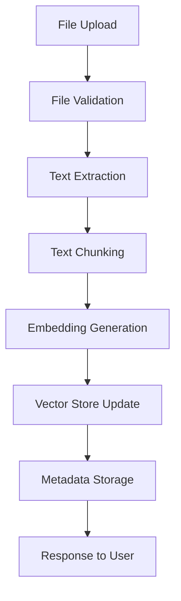
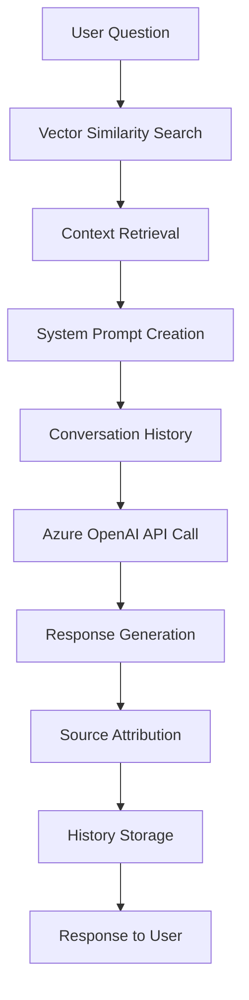

# AI Document Chat Agent - Code Walkthrough

This document provides a comprehensive step-by-step walkthrough of the AI Document Chat Agent codebase, explaining the main components, key functions, algorithms, and integrations.

## 📋 Table of Contents

1. [Application Entry Point](#1-application-entry-point)
2. [Configuration Management](#2-configuration-management)
3. [Data Models and Schemas](#3-data-models-and-schemas)
4. [Document Processing Service](#4-document-processing-service)
5. [Vector Store Service](#5-vector-store-service)
6. [Chat Service](#6-chat-service)
7. [API Endpoints](#7-api-endpoints)
8. [Frontend Implementation](#8-frontend-implementation)
9. [Key Algorithms and Workflows](#9-key-algorithms-and-workflows)
10. [Challenges and Solutions](#10-challenges-and-solutions)

---

## 1. Application Entry Point

### 1.1 Main FastAPI Application (`app/main.py`)

The application starts with the FastAPI setup in `app/main.py`:

```python
# Create FastAPI app with comprehensive configuration
app = FastAPI(
    title="AI Document Chat Agent",
    description="An AI-powered agent for answering questions based on uploaded documents",
    version="1.0.0",
    docs_url="/api/docs",        # Swagger UI
    redoc_url="/api/redoc"       # ReDoc UI
)
```

**Key Features:**
- **Automatic API Documentation**: FastAPI generates interactive docs at `/api/docs`
- **CORS Middleware**: Enables cross-origin requests for web interface
- **Static File Serving**: Serves CSS, JavaScript, and other assets
- **Template Rendering**: Uses Jinja2 for HTML templates

```python
# CORS configuration for web interface
app.add_middleware(
    CORSMiddleware,
    allow_origins=["*"],  # Configure specific origins in production
    allow_credentials=True,
    allow_methods=["*"],
    allow_headers=["*"],
)

# Mount static files and setup templates
app.mount("/static", StaticFiles(directory="static"), name="static")
templates = Jinja2Templates(directory="templates")
```

### 1.2 Application Startup (`run.py`)

The `run.py` script provides a convenient way to start the application:

```python
if __name__ == "__main__":
    print("🚀 Starting AI Document Chat Agent...")
    print(f"📍 Server will be available at: http://{settings.host}:{settings.port}")
    
    uvicorn.run(
        "app.main:app",
        host=settings.host,
        port=settings.port,
        reload=settings.debug,  # Auto-reload in development
        log_level="info"
    )
```

---

## 2. Configuration Management

### 2.1 Settings Class (`app/core/config.py`)

The configuration system uses Pydantic for type-safe environment variable handling:

```python
class Settings(BaseSettings):
    # Azure OpenAI Configuration
    azure_openai_api_key: Optional[str] = os.getenv("AZURE_OPENAI_API_KEY")
    azure_openai_endpoint: Optional[str] = os.getenv("AZURE_OPENAI_ENDPOINT")
    azure_openai_api_version: str = os.getenv("AZURE_OPENAI_API_VERSION")
    
    # Application Configuration
    upload_dir: str = "uploads"
    vector_store_dir: str = "vector_store"
    max_file_size: int = Field(default=10485760, description="Maximum file size in bytes")
    
    # Vector Store Configuration
    chunk_size: int = 1000
    chunk_overlap: int = 200
```

**Key Features:**
- **Type Safety**: Pydantic validates and converts environment variables
- **Default Values**: Sensible defaults for all configuration options
- **Validation**: Custom validators for complex configuration parsing
- **Environment File Support**: Automatically loads from `.env` file

### 2.2 Configuration Validators

Custom validators handle complex configuration parsing:

```python
@validator('max_file_size', pre=True)
def parse_max_file_size(cls, v):
    """Parse max_file_size, handling comments in the value."""
    if isinstance(v, str):
        # Remove comments and whitespace
        v = v.split('#')[0].strip()
        return int(v)
    return v

@validator('debug', pre=True)
def parse_debug(cls, v):
    """Parse debug flag, handling various string representations."""
    if isinstance(v, str):
        v = v.lower().strip()
        if v in ('true', '1', 'yes', 'on'):
            return True
        elif v in ('false', '0', 'no', 'off', 'warn', 'warning'):
            return False
    return bool(v)
```

---

## 3. Data Models and Schemas

### 3.1 Pydantic Models (`app/models/schemas.py`)

The application uses Pydantic models for request/response validation:

```python
class ChatRequest(BaseModel):
    """Request model for chat endpoint."""
    question: str = Field(..., min_length=1, max_length=1000, description="User's question")
    conversation_id: Optional[str] = Field(None, description="Optional conversation ID for context")

class ChatResponse(BaseModel):
    """Response model for chat endpoint."""
    answer: str = Field(..., description="AI-generated answer")
    sources: List[str] = Field(default_factory=list, description="Source documents used")
    conversation_id: str = Field(..., description="Conversation ID")
```

**Benefits:**
- **Automatic Validation**: Input validation with detailed error messages
- **Type Safety**: Ensures data consistency throughout the application
- **API Documentation**: Automatically generates OpenAPI schema
- **Serialization**: Handles JSON serialization/deserialization

---

## 4. Document Processing Service

### 4.1 DocumentProcessor Class (`app/services/document_processor.py`)

The document processor handles file upload, text extraction, and chunking:

```python
class DocumentProcessor:
    def __init__(self):
        self.text_splitter = RecursiveCharacterTextSplitter(
            chunk_size=settings.chunk_size,      # 1000 characters
            chunk_overlap=settings.chunk_overlap, # 200 characters
            length_function=len,
        )
        self.metadata_file = os.path.join(settings.upload_dir, "metadata.json")
        self._load_metadata()
```

### 4.2 Text Extraction Methods

The service supports multiple file formats with dedicated extraction methods:

```python
def extract_text_from_pdf(self, file_path: str) -> str:
    """Extract text from PDF file using PyPDF2."""
    text = ""
    try:
        with open(file_path, 'rb') as file:
            pdf_reader = PyPDF2.PdfReader(file)
            for page in pdf_reader.pages:
                text += page.extract_text() + "\n"
    except Exception as e:
        raise ValueError(f"Error extracting text from PDF: {str(e)}")
    return text

def extract_text_from_docx(self, file_path: str) -> str:
    """Extract text from DOCX file using python-docx."""
    try:
        doc = Document(file_path)
        text = ""
        for paragraph in doc.paragraphs:
            text += paragraph.text + "\n"
    except Exception as e:
        raise ValueError(f"Error extracting text from DOCX: {str(e)}")
    return text
```

### 4.3 Document Processing Workflow

The main processing workflow combines extraction, chunking, and metadata management:

```python
def process_document(self, file_path: str, filename: str) -> Dict[str, Any]:
    """Process uploaded document and extract text chunks."""
    document_id = str(uuid.uuid4())
    file_extension = Path(filename).suffix
    
    try:
        # 1. Extract text from document
        text = self.extract_text(file_path, file_extension)
        
        if not text.strip():
            raise ValueError("No text content found in the document")
        
        # 2. Split text into chunks using LangChain
        chunks = self.text_splitter.split_text(text)
        
        # 3. Store metadata
        file_size = os.path.getsize(file_path)
        metadata = {
            "document_id": document_id,
            "filename": filename,
            "file_path": file_path,
            "file_size": file_size,
            "upload_date": datetime.now().isoformat(),
            "status": "processed",
            "chunks_count": len(chunks),
            "file_extension": file_extension
        }
        
        self.metadata[document_id] = metadata
        self._save_metadata()
        
        return {
            "document_id": document_id,
            "chunks": chunks,
            "metadata": metadata
        }
    except Exception as e:
        # Handle errors and update metadata
        if document_id in self.metadata:
            self.metadata[document_id]["status"] = "error"
            self.metadata[document_id]["error"] = str(e)
            self._save_metadata()
        raise e
```

**Key Algorithms:**
- **Text Chunking**: Uses LangChain's RecursiveCharacterTextSplitter for intelligent text segmentation
- **Metadata Management**: JSON-based storage for document information and status tracking
- **Error Handling**: Comprehensive error tracking with status updates

---

## 5. Vector Store Service

### 5.1 VectorStore Class (`app/services/vector_store.py`)

The vector store manages document embeddings and similarity search using FAISS:

```python
class VectorStore:
    def __init__(self, use_local_embeddings: bool = True):
        self.embeddings = None
        self.embedding_type = "none"
        
        # Try local embeddings first, fallback to Azure OpenAI
        if use_local_embeddings:
            try:
                self.embeddings = LocalEmbeddings()
                self.embedding_type = "local"
                self.dimension = self.embeddings.get_dimension()
                print(f"✅ Using local embeddings (dimension: {self.dimension})")
            except Exception as e:
                print(f"⚠️  Failed to load local embeddings: {e}")
                use_local_embeddings = False
        
        if not use_local_embeddings:
            # Fallback to Azure OpenAI embeddings
            if (settings.azure_openai_api_key and settings.azure_openai_endpoint):
                try:
                    self.embeddings = AzureOpenAIEmbeddings(
                        azure_endpoint=settings.azure_openai_endpoint,
                        api_key=settings.azure_openai_api_key,
                        api_version=settings.azure_openai_api_version,
                        azure_deployment="text-embedding-ada-002"
                    )
                    self.embedding_type = "azure"
                    self.dimension = 1536  # OpenAI embedding dimension
                except Exception as e:
                    print(f"⚠️  Azure OpenAI connection failed: {e}")
```

### 5.2 FAISS Index Management

The service handles FAISS index creation, loading, and persistence:

```python
def _load_or_create_index(self) -> None:
    """Load existing index or create a new one."""
    if os.path.exists(self.index_file) and os.path.exists(self.metadata_file):
        try:
            # Load FAISS index
            self.index = faiss.read_index(self.index_file)
            
            # Load metadata
            with open(self.metadata_file, 'rb') as f:
                self.metadata = pickle.load(f)
            
            print(f"Loaded existing vector store with {len(self.metadata)} documents")
        except Exception as e:
            print(f"Error loading vector store: {e}")
            self._create_new_index()
    else:
        self._create_new_index()

def _create_new_index(self) -> None:
    """Create a new FAISS index."""
    self.index = faiss.IndexFlatL2(self.dimension)  # L2 distance metric
    self.metadata = []
    print("Created new vector store")
```

### 5.3 Document Addition and Search

The core functionality for adding documents and performing similarity search:

```python
def add_documents(self, chunks: List[str], document_id: str, filename: str) -> None:
    """Add document chunks to the vector store."""
    if not self.embeddings:
        raise ValueError("No embedding service available.")
    
    try:
        # Generate embeddings for chunks
        embeddings = self.embeddings.embed_documents(chunks)
        embeddings_array = np.array(embeddings, dtype=np.float32)
        
        # Add to FAISS index
        self.index.add(embeddings_array)
        
        # Store metadata for each chunk
        for i, chunk in enumerate(chunks):
            chunk_metadata = {
                "document_id": document_id,
                "filename": filename,
                "chunk_index": i,
                "text": chunk,
                "vector_id": len(self.metadata)
            }
            self.metadata.append(chunk_metadata)
        
        # Save to disk
        self._save_index()
        
    except Exception as e:
        raise ValueError(f"Error adding documents to vector store: {str(e)}")

def similarity_search(self, query: str, k: int = 5) -> List[Dict[str, Any]]:
    """Perform similarity search and return relevant chunks."""
    if not self.embeddings or self.index.ntotal == 0:
        return []
    
    try:
        # Generate embedding for query
        query_embedding = self.embeddings.embed_query(query)
        query_vector = np.array([query_embedding], dtype=np.float32)
        
        # Search in FAISS index
        distances, indices = self.index.search(query_vector, min(k, self.index.ntotal))
        
        # Retrieve metadata for found chunks
        results = []
        for i, (distance, idx) in enumerate(zip(distances[0], indices[0])):
            if idx < len(self.metadata):
                result = self.metadata[idx].copy()
                result["similarity_score"] = float(distance)
                result["rank"] = i + 1
                results.append(result)
        
        return results
        
    except Exception as e:
        print(f"Error during similarity search: {e}")
        return []
```

**Key Algorithms:**
- **FAISS L2 Distance**: Uses Euclidean distance for similarity measurement
- **Embedding Generation**: Supports both local and Azure OpenAI embeddings
- **Metadata Synchronization**: Maintains alignment between FAISS index and metadata

---

## 6. Chat Service

### 6.1 ChatService Class (`app/services/chat_service.py`)

The chat service integrates Azure OpenAI for intelligent question answering:

```python
class ChatService:
    def __init__(self, vector_store: VectorStore):
        self.vector_store = vector_store
        
        # Initialize Azure OpenAI client
        if (settings.azure_openai_api_key and 
            settings.azure_openai_endpoint and 
            settings.azure_openai_deployment_name):
            try:
                self.llm = AzureOpenAI(
                    api_key=settings.azure_openai_api_key,
                    azure_endpoint=settings.azure_openai_endpoint,
                    api_version=settings.azure_openai_api_version
                )
                # Test connection
                test_response = self.llm.chat.completions.create(
                    model=settings.azure_openai_deployment_name,
                    messages=[{"role": "user", "content": "Hello"}],
                    max_tokens=5,
                    timeout=10
                )
                print("✅ Azure OpenAI chat service configured successfully")
            except Exception as e:
                print(f"⚠️  Azure OpenAI connection failed: {e}")
                self.llm = None
        else:
            self.llm = None
        
        # Store conversation history
        self.conversations: Dict[str, List[Dict[str, str]]] = {}
```

### 6.2 System Prompt Generation

The service creates context-aware prompts using retrieved document chunks:

```python
def _create_system_prompt(self, context_chunks: List[Dict[str, Any]]) -> str:
    """Create system prompt with document context."""
    if not context_chunks:
        return """You are a helpful AI assistant. The user is asking a question, but no relevant documents were found in the knowledge base. Please let them know that you don't have specific information about their query in the uploaded documents, but you can provide general assistance if helpful."""
    
    context_text = "\n\n".join([
        f"Document: {chunk['filename']}\nContent: {chunk['text']}"
        for chunk in context_chunks
    ])
    
    return f"""You are a helpful AI assistant that answers questions based on the provided document context. 

CONTEXT FROM UPLOADED DOCUMENTS:
{context_text}

INSTRUCTIONS:
1. Answer the user's question using ONLY the information provided in the context above
2. If the context doesn't contain enough information to answer the question, say so clearly
3. Always cite which document(s) you're referencing in your answer
4. Be concise but comprehensive
5. If asked about something not in the documents, explain that the information is not available in the uploaded documents

Remember: Only use information from the provided context. Do not make up information or use knowledge outside of the provided documents."""
```

### 6.3 Chat Processing Workflow

The main chat processing combines retrieval, context creation, and response generation:

```python
def chat(self, question: str, conversation_id: Optional[str] = None, k: int = 5) -> Dict[str, Any]:
    """Process a chat question and return an answer with sources."""
    
    # Generate conversation ID if not provided
    if not conversation_id:
        conversation_id = str(uuid.uuid4())
    
    # Check if LLM is configured
    if not self.llm:
        return {
            "answer": "I apologize, but the AI chat service is not configured...",
            "sources": [],
            "conversation_id": conversation_id,
            "error": "Azure OpenAI not configured"
        }
    
    try:
        # 1. Retrieve relevant context from vector store
        context_chunks = self.vector_store.similarity_search(question, k=k)
        
        # 2. Create system prompt with context
        system_prompt = self._create_system_prompt(context_chunks)
        
        # 3. Prepare messages for OpenAI API
        messages = [
            {"role": "system", "content": system_prompt},
            {"role": "user", "content": question}
        ]
        
        # 4. Add conversation history if available
        if conversation_id in self.conversations:
            recent_history = self.conversations[conversation_id][-6:]  # Last 3 Q&A pairs
            history_messages = []
            for entry in recent_history:
                if entry["role"] == "user":
                    history_messages.append({"role": "user", "content": entry["content"]})
                elif entry["role"] == "assistant":
                    history_messages.append({"role": "assistant", "content": entry["content"]})
            
            # Insert history before the current question
            messages = [messages[0]] + history_messages + [messages[1]]
        
        # 5. Get response from Azure OpenAI
        response = self.llm.chat.completions.create(
            model=settings.azure_openai_deployment_name,
            messages=messages,
            max_tokens=1000,
            temperature=0.7,
            timeout=30
        )
        answer = response.choices[0].message.content
        
        # 6. Format sources and store conversation
        sources = self._format_sources(context_chunks)
        
        # Store conversation history
        if conversation_id not in self.conversations:
            self.conversations[conversation_id] = []
        
        self.conversations[conversation_id].extend([
            {"role": "user", "content": question},
            {"role": "assistant", "content": answer}
        ])
        
        # Keep only last 10 exchanges per conversation
        if len(self.conversations[conversation_id]) > 20:
            self.conversations[conversation_id] = self.conversations[conversation_id][-20:]
        
        return {
            "answer": answer,
            "sources": sources,
            "conversation_id": conversation_id,
            "context_chunks_found": len(context_chunks)
        }
        
    except Exception as e:
        error_msg = f"Error processing chat request: {str(e)}"
        return {
            "answer": "I apologize, but I encountered an error...",
            "sources": [],
            "conversation_id": conversation_id,
            "error": error_msg
        }
```

**Key Algorithms:**
- **Retrieval-Augmented Generation (RAG)**: Combines vector search with LLM generation
- **Context Window Management**: Maintains conversation history within token limits
- **Source Attribution**: Tracks and cites document sources for transparency

---

## 7. API Endpoints

### 7.1 Endpoint Structure (`app/api/endpoints.py`)

The API layer provides RESTful endpoints with comprehensive validation:

```python
router = APIRouter()

@router.post("/upload", response_model=DocumentUploadResponse)
async def upload_document(file: UploadFile = File(...)):
    """Upload and process a document."""
    
    # 1. Validate file type
    if not file.filename.lower().endswith(('.pdf', '.docx', '.txt')):
        raise HTTPException(
            status_code=400,
            detail="Unsupported file type. Please upload PDF, DOCX, or TXT files."
        )
    
    # 2. Validate file size
    file_size = 0
    content = await file.read()
    file_size = len(content)
    
    if file_size > settings.max_file_size:
        raise HTTPException(
            status_code=413,
            detail=f"File too large. Maximum size is {settings.max_file_size} bytes."
        )
    
    # 3. Save file and process
    try:
        # Save uploaded file
        file_path = os.path.join(settings.upload_dir, file.filename)
        with open(file_path, 'wb') as f:
            f.write(content)
        
        # Process document
        result = document_processor.process_document(file_path, file.filename)
        
        # Add to vector store
        vector_store.add_documents(
            result["chunks"],
            result["document_id"],
            file.filename
        )
        
        return DocumentUploadResponse(
            message="Document uploaded and processed successfully",
            filename=file.filename,
            file_size=file_size,
            document_id=result["document_id"]
        )
        
    except Exception as e:
        raise HTTPException(status_code=500, detail=str(e))
```

### 7.2 Chat Endpoint

The chat endpoint handles question processing with comprehensive error handling:

```python
@router.post("/chat", response_model=ChatResponse)
async def chat_with_documents(request: ChatRequest):
    """Send a chat message and get an AI response."""
    
    try:
        # Process chat request
        result = chat_service.chat(
            question=request.question,
            conversation_id=request.conversation_id
        )
        
        # Check for errors
        if "error" in result:
            raise HTTPException(
                status_code=500,
                detail=result["error"]
            )
        
        return ChatResponse(
            answer=result["answer"],
            sources=result["sources"],
            conversation_id=result["conversation_id"]
        )
        
    except HTTPException:
        raise
    except Exception as e:
        raise HTTPException(
            status_code=500,
            detail=f"Error processing chat request: {str(e)}"
        )
```

**Key Features:**
- **Input Validation**: Pydantic models ensure data integrity
- **Error Handling**: Comprehensive error responses with appropriate HTTP status codes
- **File Upload**: Secure file handling with size and type validation
- **Response Models**: Structured responses with automatic documentation

---

## 8. Frontend Implementation

### 8.1 HTML Structure (`templates/index.html`)

The frontend uses semantic HTML with modern accessibility features:

```html
<div class="container">
    <!-- Header -->
    <header class="header">
        <div class="header-content">
            <h1><i class="fas fa-robot"></i> AI Document Chat Agent</h1>
            <p>Upload documents and ask questions to get intelligent answers</p>
        </div>
    </header>

    <!-- Main Content -->
    <main class="main-content">
        <!-- Sidebar for document management -->
        <aside class="sidebar">
            <!-- Upload Section -->
            <div class="upload-section">
                <h3><i class="fas fa-upload"></i> Upload Documents</h3>
                <div class="upload-area" id="uploadArea">
                    <i class="fas fa-cloud-upload-alt"></i>
                    <p>Drag & drop files here or click to browse</p>
                    <p class="file-types">Supported: PDF, DOCX, TXT</p>
                    <input type="file" id="fileInput" accept=".pdf,.docx,.txt" multiple hidden>
                </div>
            </div>
            
            <!-- Documents List -->
            <div class="documents-section">
                <h3><i class="fas fa-file-alt"></i> Uploaded Documents</h3>
                <div class="documents-list" id="documentsList">
                    <p class="no-documents">No documents uploaded yet</p>
                </div>
            </div>
            
            <!-- Statistics -->
            <div class="stats-section">
                <h3><i class="fas fa-chart-bar"></i> Statistics</h3>
                <div class="stats-grid" id="statsGrid">
                    <!-- Dynamic stats content -->
                </div>
            </div>
        </aside>

        <!-- Chat Area -->
        <section class="chat-area">
            <div class="chat-header">
                <h2><i class="fas fa-comments"></i> Chat with Your Documents</h2>
                <button class="btn btn-secondary" id="clearChatBtn">
                    <i class="fas fa-trash"></i> Clear Chat
                </button>
            </div>

            <div class="chat-messages" id="chatMessages">
                <!-- Dynamic chat messages -->
            </div>

            <div class="chat-input-area">
                <div class="input-container">
                    <input type="text" id="chatInput" placeholder="Ask a question about your documents..." maxlength="1000">
                    <button id="sendBtn" class="send-btn" disabled>
                        <i class="fas fa-paper-plane"></i>
                    </button>
                </div>
            </div>
        </section>
    </main>
</div>
```

### 8.2 JavaScript Implementation (`static/js/app.js`)

The frontend JavaScript handles user interactions and API communication:

```javascript
class DocumentChatApp {
    constructor() {
        this.conversationId = null;
        this.initializeEventListeners();
        this.loadDocuments();
        this.loadStats();
    }

    initializeEventListeners() {
        // File upload handling
        const uploadArea = document.getElementById('uploadArea');
        const fileInput = document.getElementById('fileInput');
        
        uploadArea.addEventListener('click', () => fileInput.click());
        uploadArea.addEventListener('dragover', this.handleDragOver.bind(this));
        uploadArea.addEventListener('drop', this.handleFileDrop.bind(this));
        fileInput.addEventListener('change', this.handleFileSelect.bind(this));
        
        // Chat handling
        const chatInput = document.getElementById('chatInput');
        const sendBtn = document.getElementById('sendBtn');
        
        chatInput.addEventListener('keypress', (e) => {
            if (e.key === 'Enter' && !e.shiftKey) {
                e.preventDefault();
                this.sendMessage();
            }
        });
        
        sendBtn.addEventListener('click', this.sendMessage.bind(this));
    }

    async uploadFile(file) {
        const formData = new FormData();
        formData.append('file', file);
        
        try {
            const response = await fetch('/api/v1/upload', {
                method: 'POST',
                body: formData
            });
            
            if (!response.ok) {
                const error = await response.json();
                throw new Error(error.detail || 'Upload failed');
            }
            
            const result = await response.json();
            this.showToast(`✅ ${result.filename} uploaded successfully!`, 'success');
            this.loadDocuments();
            this.loadStats();
            
        } catch (error) {
            this.showToast(`❌ Upload failed: ${error.message}`, 'error');
        }
    }

    async sendMessage() {
        const chatInput = document.getElementById('chatInput');
        const message = chatInput.value.trim();
        
        if (!message) return;
        
        // Add user message to chat
        this.addMessageToChat(message, 'user');
        chatInput.value = '';
        
        // Show typing indicator
        this.showTypingIndicator();
        
        try {
            const response = await fetch('/api/v1/chat', {
                method: 'POST',
                headers: {
                    'Content-Type': 'application/json'
                },
                body: JSON.stringify({
                    question: message,
                    conversation_id: this.conversationId
                })
            });
            
            if (!response.ok) {
                const error = await response.json();
                throw new Error(error.detail || 'Chat request failed');
            }
            
            const result = await response.json();
            this.conversationId = result.conversation_id;
            
            // Remove typing indicator and add response
            this.removeTypingIndicator();
            this.addMessageToChat(result.answer, 'assistant', result.sources);
            
        } catch (error) {
            this.removeTypingIndicator();
            this.addMessageToChat(`❌ Error: ${error.message}`, 'error');
        }
    }
}

// Initialize the application
document.addEventListener('DOMContentLoaded', () => {
    new DocumentChatApp();
});
```

**Key Features:**
- **Drag & Drop Upload**: Modern file upload with visual feedback
- **Real-time Chat**: Asynchronous message handling with typing indicators
- **Error Handling**: User-friendly error messages and status updates
- **Responsive Design**: Mobile-first approach with flexible layouts

---

## 9. Key Algorithms and Workflows

### 9.1 Document Processing Pipeline



**Steps:**
1. **File Validation**: Check file type, size, and format
2. **Text Extraction**: Extract text using format-specific libraries
3. **Text Chunking**: Split text using LangChain's RecursiveCharacterTextSplitter
4. **Embedding Generation**: Create vector embeddings using Azure OpenAI or local models
5. **Vector Store Update**: Add embeddings to FAISS index
6. **Metadata Storage**: Store document information and chunk metadata
7. **Response**: Return success status and document ID

### 9.2 Chat Processing Pipeline



**Steps:**
1. **Vector Similarity Search**: Find relevant document chunks using FAISS
2. **Context Retrieval**: Extract text content from matching chunks
3. **System Prompt Creation**: Build context-aware prompt with instructions
4. **Conversation History**: Include recent conversation context
5. **Azure OpenAI API Call**: Generate response using GPT-4
6. **Response Generation**: Process and format the AI response
7. **Source Attribution**: Identify and format source documents
8. **History Storage**: Save conversation for future context
9. **Response**: Return answer with sources and conversation ID

### 9.3 Vector Similarity Search Algorithm

The similarity search uses FAISS with L2 (Euclidean) distance:

```python
def similarity_search(self, query: str, k: int = 5) -> List[Dict[str, Any]]:
    # 1. Generate query embedding
    query_embedding = self.embeddings.embed_query(query)
    query_vector = np.array([query_embedding], dtype=np.float32)
    
    # 2. FAISS similarity search
    distances, indices = self.index.search(query_vector, min(k, self.index.ntotal))
    
    # 3. Retrieve and rank results
    results = []
    for i, (distance, idx) in enumerate(zip(distances[0], indices[0])):
        if idx < len(self.metadata):
            result = self.metadata[idx].copy()
            result["similarity_score"] = float(distance)
            result["rank"] = i + 1
            results.append(result)
    
    return results
```

**Algorithm Details:**
- **Embedding Generation**: Convert query to vector representation
- **FAISS Search**: Efficient approximate nearest neighbor search
- **Distance Metric**: L2 (Euclidean) distance for similarity measurement
- **Result Ranking**: Sort by similarity score and add ranking information

---

## 10. Challenges and Solutions

### 10.1 Challenge: Embedding Service Reliability

**Problem**: Azure OpenAI service might be unavailable or misconfigured.

**Solution**: Implemented fallback system with local embeddings:

```python
# Primary: Try local embeddings first
if use_local_embeddings:
    try:
        self.embeddings = LocalEmbeddings()
        self.embedding_type = "local"
        print("✅ Using local embeddings")
    except Exception as e:
        print(f"⚠️  Failed to load local embeddings: {e}")
        use_local_embeddings = False

# Fallback: Azure OpenAI embeddings
if not use_local_embeddings:
    if (settings.azure_openai_api_key and settings.azure_openai_endpoint):
        try:
            self.embeddings = AzureOpenAIEmbeddings(...)
            self.embedding_type = "azure"
        except Exception as e:
            print(f"⚠️  Azure OpenAI connection failed: {e}")
```

### 10.2 Challenge: Large Document Processing

**Problem**: Large documents can overwhelm memory and processing time.

**Solution**: Implemented intelligent chunking strategy:

```python
self.text_splitter = RecursiveCharacterTextSplitter(
    chunk_size=1000,        # Manageable chunk size
    chunk_overlap=200,      # Preserve context between chunks
    length_function=len,    # Character-based splitting
)
```

**Benefits:**
- **Memory Efficiency**: Process documents in smaller chunks
- **Context Preservation**: Overlap maintains semantic continuity
- **Search Granularity**: Smaller chunks improve search precision

### 10.3 Challenge: Conversation Context Management

**Problem**: Maintaining conversation context while respecting token limits.

**Solution**: Implemented sliding window approach:

```python
# Add recent conversation history (last 3 exchanges)
if conversation_id in self.conversations:
    recent_history = self.conversations[conversation_id][-6:]  # 3 Q&A pairs
    
    # Insert history before current question
    messages = [system_prompt] + history_messages + [current_question]

# Keep only last 10 exchanges per conversation
if len(self.conversations[conversation_id]) > 20:
    self.conversations[conversation_id] = self.conversations[conversation_id][-20:]
```

### 10.4 Challenge: File Upload Security

**Problem**: Ensuring secure file uploads without vulnerabilities.

**Solution**: Implemented comprehensive validation:

```python
# 1. File type validation
if not file.filename.lower().endswith(('.pdf', '.docx', '.txt')):
    raise HTTPException(status_code=400, detail="Unsupported file type")

# 2. File size validation
if file_size > settings.max_file_size:
    raise HTTPException(status_code=413, detail="File too large")

# 3. Content validation
text = self.extract_text(file_path, file_extension)
if not text.strip():
    raise ValueError("No text content found in the document")
```

### 10.5 Challenge: Vector Store Persistence

**Problem**: Maintaining vector store state across application restarts.

**Solution**: Implemented automatic save/load functionality:

```python
def _save_index(self) -> None:
    """Save the FAISS index and metadata to disk."""
    try:
        faiss.write_index(self.index, self.index_file)
        with open(self.metadata_file, 'wb') as f:
            pickle.dump(self.metadata, f)
    except Exception as e:
        print(f"Error saving vector store: {e}")

def _load_or_create_index(self) -> None:
    """Load existing index or create a new one."""
    if os.path.exists(self.index_file) and os.path.exists(self.metadata_file):
        try:
            self.index = faiss.read_index(self.index_file)
            with open(self.metadata_file, 'rb') as f:
                self.metadata = pickle.load(f)
        except Exception as e:
            self._create_new_index()
    else:
        self._create_new_index()
```

---

## 🎯 Summary

This code walkthrough demonstrates a well-architected AI document chat system with the following key strengths:

### **Technical Excellence**
- **Modular Design**: Clear separation of concerns across services
- **Type Safety**: Comprehensive use of Pydantic for validation
- **Error Handling**: Robust error management throughout the stack
- **Fallback Systems**: Graceful degradation when services are unavailable

### **User Experience**
- **Modern Interface**: Responsive design with intuitive interactions
- **Real-time Feedback**: Progress indicators and status updates
- **Accessibility**: Semantic HTML and keyboard navigation support
- **Performance**: Efficient algorithms for fast response times

### **Scalability Considerations**
- **Stateless Design**: Services can be horizontally scaled
- **Configurable Parameters**: Easy tuning for different use cases
- **Persistent Storage**: Maintains state across restarts
- **Resource Management**: Efficient memory and storage usage

### **Integration Patterns**
- **RAG Architecture**: Combines retrieval and generation effectively
- **API-First Design**: Clean separation between frontend and backend
- **Service Abstraction**: Easy to swap implementations (local vs. cloud)
- **Configuration Management**: Environment-based configuration

The codebase demonstrates best practices for building production-ready AI applications with FastAPI, providing a solid foundation for further development and customization. 